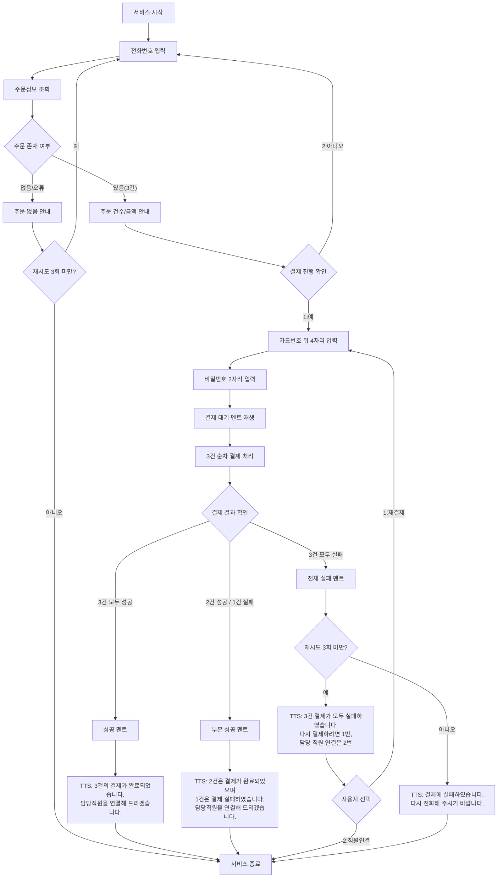

# ARS 시나리오 흐름 분석 (KICC Travelport - 최신 설정 기준)

본 문서는 `KICC_Travelport_Scenario.cpp` 소스 코드와 현재 설정(`SKIP_PHONE_CONFIRM`, `m_bUseDbCardInfo = 1`)을 기반으로 ARS 시나리오의 멘트 및 사용자 입력 흐름을 정리한 것입니다.

## 1. 성공 케이스 (3건 주문 모두 성공 가정)

사용자가 전화를 걸어 3건의 주문을 조회하고, 모두 정상적으로 결제 완료하는 흐름입니다.

### [1단계] 전화번호 입력 및 조회
1. **(멘트)** `ment/Travelport/input_telnum_start`
   * 내용: "전화 번호를 입력하여 주십시오."
2. **(사용자 입력)** 전화번호 입력 (예: 01012345678)
   * *참고: 전화번호 확인 단계("맞으면 1번...")는 설정에 의해 생략되고 바로 주문 조회로 넘어갑니다.*

### [2단계] 주문 정보 안내 (다중 주문)
3. **(멘트 - TTS)** "고객님의 항공권 결제 금액은 3건 , 총 승인금액은 [총액] 원입니다"
4. **(멘트)** `ment/_common/common_audio/input_confirm`
   * 내용: "맞으면 1번, 틀리면 2번을 눌러주십시오." (결제 진행 여부 확인)
5. **(사용자 입력)** `1` (결제 진행)

### [3단계] 결제 정보 입력 (DB 카드 정보 사용 모드)
6. **(멘트)** `ment/Travelport/input_card_num_4`
   * 내용: "카드번호 뒤 4자리를 입력하여 주십시오."
7. **(사용자 입력)** 카드번호 뒤 4자리 (예: 1234)
   * *참고: 카드번호 확인, 유효기간 입력, 주민번호 입력, 할부개월 입력 단계는 DB 정보를 사용하여 생략됩니다.*
8. **(멘트)** `ment/Travelport/input_pass_start`
    * 내용: "카드 비밀번호 네자리중, 앞, 두자리를 입력하여 주시기 바랍니다."
9. **(사용자 입력)** 비밀번호 앞 2자리 (예: 12)

### [4단계] 결제 처리 및 완료
10. **(멘트)** `ment/Travelport/pay_request_wait`
    * 내용: "결제 요청 중입니다. 잠시만 기다려 주시기 바랍니다."
    * *(내부적으로 3건에 대해 순차적 결제 승인 요청 진행)*
11. **(멘트 - TTS)** "3건의 결제가 완료되었습니다. 담당직원을 연결해 드리겠습니다."
12. **(멘트)** `ment/_common/common_audio/service_end`
    * 내용: "이용해 주셔서 감사합니다." (서비스 종료)

---

## 2. 시나리오 흐름도 (실패 및 재시도 포함)

주문 건수 3건을 가정했을 때, 입력 오류 및 결제 결과에 따른 분기 처리를 포함한 흐름입니다.

### 케이스별 상세 멘트 (결제 결과 부분)

#### A. 3건 모두 성공한 경우
* **상태:** 성공 3건 / 실패 0건
* **멘트:** "3건의 결제가 완료되었습니다. 담당직원을 연결해 드리겠습니다."
* **후속 동작:** 서비스 종료 (담당자 연결)

#### B. 부분 성공 (2건 성공, 1건 실패)
* **상태:** 성공 2건 / 실패 1건
* **멘트:** "2건은 결제가 완료되었으며 1건은 결제 실패하였습니다. 담당직원을 연결해 드리겠습니다."
* **후속 동작:** 서비스 종료 (담당자 연결)

#### C. 3건 모두 실패한 경우
* **상태:** 성공 0건 / 실패 3건
* **멘트:** "3건 결제가 모두 실패하였습니다. 다시 결제를 진행하시려면 1번, 담당 직원을 연결하시려면 2번을 눌러 주시기 바랍니다."
* **후속 동작 (사용자 선택):**
    * **1번 선택 시:** 카드번호 입력 단계(`ment/Travelport/input_card_num_4`)로 이동하여 재시도 (최대 3회)
    * **2번 선택 시:** 서비스 종료 (담당자 연결)
    * **입력 없음/오류 시:** 멘트 재송출 후 종료

### 특이 사항
* **카드 정보 입력:** DB에 저장된 카드 정보를 활용하므로, 사용자는 **카드번호 뒤 4자리**만 입력합니다. (유효기간 입력 생략)
* **주민번호 입력:** 소스 코드 상에서 주민번호 입력 단계는 생략되고 바로 비밀번호 입력으로 넘어갑니다.
* **결제 대기:** 결제 건수가 여러 건이라도 대기 멘트("결제 요청 중입니다...")는 최초 1회만 송출됩니다.
* **전화번호 확인:** 소스 코드의 `#if SKIP_PHONE_CONFIRM` 전처리기 분기에 따라 전화번호 확인(맞으면 1번) 단계가 생략될 수 있으나, 기본적으로는 확인 단계를 거치는 것으로 분석되었습니다.